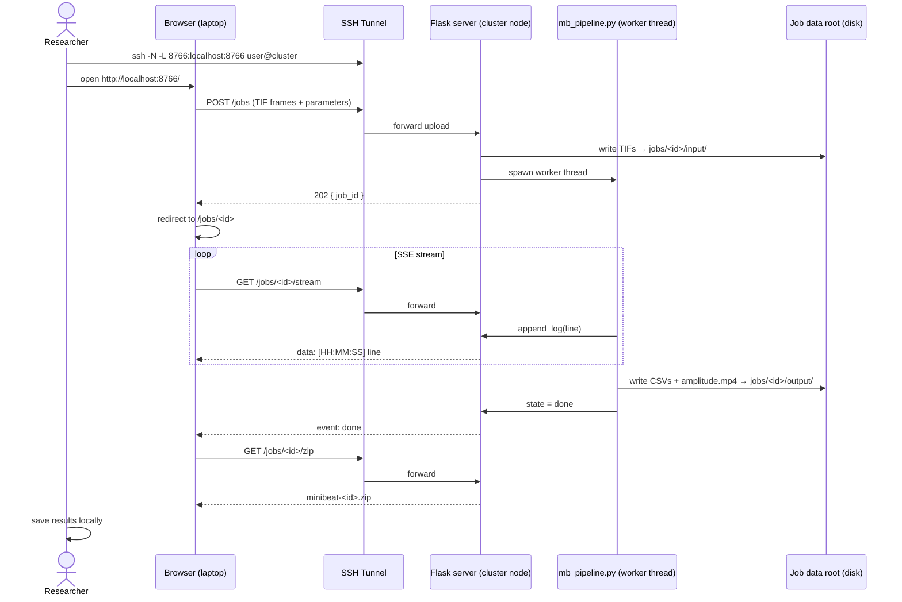

# MiniBeat HPC Tracker

Server/cluster mode for [MiniBeat Tracker](../minibeat-tracker) — submit cardiomyocyte motion
analysis jobs through a browser, run the full pipeline headlessly on an HPC node, and download
results as a ZIP.

No MATLAB, no GUI toolkit, no GPU required. The analysis runs on CPU using the same
numba-accelerated block matching and joblib parallelism as the desktop app.

---

## Architecture



---

## What it does

The pipeline mirrors the four-step MiniBeat Tracker desktop workflow, running headlessly:

| Step | Module | Action |
|------|--------|--------|
| 1 | `mb_pipeline.py` | Load grayscale TIF frames from upload directory |
| 2 | `minibeat_tracker.core.motion` | Exhaustive block matching (numba JIT + joblib) |
| 3 | `minibeat_tracker.core.analysis` | Contraction time series + peak detection |
| 4 | `minibeat_tracker.io.export` | CSV exports + amplitude overlay video |

---

## Requirements

- Linux (HPC cluster or local workstation)
- Miniconda or Anaconda
- `minibeat-tracker/` must be present as a sibling directory (it is, inside `cardio-tracker/`)

---

## Installation

```
./setup_server.sh
```

This creates the `minibeat-hpc` conda environment at `cardio-tracker/envs/minibeat-hpc/`
with Python, NumPy, SciPy, numba, OpenCV, joblib, pandas, matplotlib, Flask, and Werkzeug.
No Qt, no napari — headless only.

---

## Running

On the cluster node (GPU is not required; the pipeline uses CPU cores via joblib):

```
conda activate minibeat-hpc
./run_server.sh
```

Open an SSH tunnel from your laptop:

```
# If the server is on the login node:
ssh -N -L 8766:localhost:8766 user@cluster.example.edu

# If it is on a compute node (e.g. cpu042) behind the login node:
ssh -N -L 8766:cpu042:8766 user@cluster.example.edu
```

Open `http://localhost:8766/` in your browser.

Override host, port, or data directory:

```
PORT=9000 DATA_ROOT=/scratch/$USER/minibeat-jobs ./run_server.sh
```

---

## Preparing input

Upload grayscale TIF/TIFF files — one file per frame, sorted by filename
(use zero-padded names such as `frame_0001.tif`, `frame_0002.tif`).

To convert an MP4 video before uploading:

```
ab_video_mp42tif.sh --gray my_video.mp4 14
# outputs: my_video_tif/frame_0001.tif ...
```

The `--gray` flag prevents chroma-subsampling errors in downstream tools.

---

## Workflow

1. **Upload** — select TIF frames in the form, set parameters, click **Run analysis**.
2. **Monitor** — the job detail page streams the pipeline log in real time via SSE.
3. **Download** — when the job completes, click **Download ZIP** or fetch individual files.
4. **Restore** — load a `mb_params.json` from any previous job ZIP to restore all parameters.

---

## Parameters

| Parameter | Default | Description |
|-----------|---------|-------------|
| Frame rate | 14 fps | Acquisition frame rate |
| Macroblock size | 16 px | Block size for motion estimation |
| Search range | 7 px | Half-window for exhaustive search |
| Delay | 2 frames | Frame pairs separated by this offset |
| Pixel size | 0 µm | Set to report in µm/sec instead of px/sec |
| Parallel workers | −1 | Number of joblib workers (−1 = all cores) |
| Neighbour σ | 2.0 | Outlier threshold for neighbour cleaning |
| FFT threshold | 4.0 | High-frequency cutoff for FFT cleaning |
| CoV threshold | 0.8 | Temporal variation threshold for block removal |
| Export video | yes | Generate amplitude overlay MP4 |

---

## Output

| File | Contents |
|------|----------|
| `*_BeatingData.csv` | Per-frame contraction amplitude time series |
| `*_RawPeaks.csv` | Detected peak times and heights |
| `*_AnaPeaks.csv` | Per-cycle contraction/relaxation intervals (if ≥ 4 peaks) |
| `*_AnaPeaksMean.csv` | Summary statistics across all cycles |
| `*_amplitude.mp4` | Heatmap overlay video |
| `mb_params.json` | Full parameter snapshot (loadable via the UI) |

---

## Reference

The motion analysis methodology is based on:

> Huebsch, N. et al. **Automated Video-Based Analysis of Contractility and Calcium Flux in Human-Induced Pluripotent Stem Cell-Derived Cardiomyocytes Cultured over Different Spatial Scales.** *Tissue Engineering Part C: Methods* (2015). https://doi.org/10.1089/ten.tec.2014.0283

---

## Related

- [MiniBeat Tracker](https://github.com/rabravo/minibeat-tracker) — desktop app (napari GUI, same pipeline)
